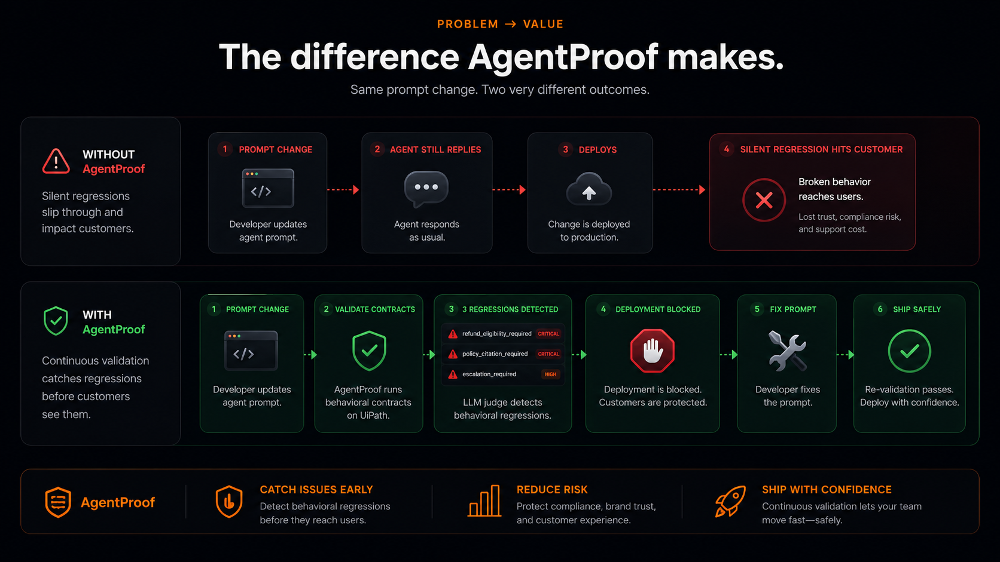
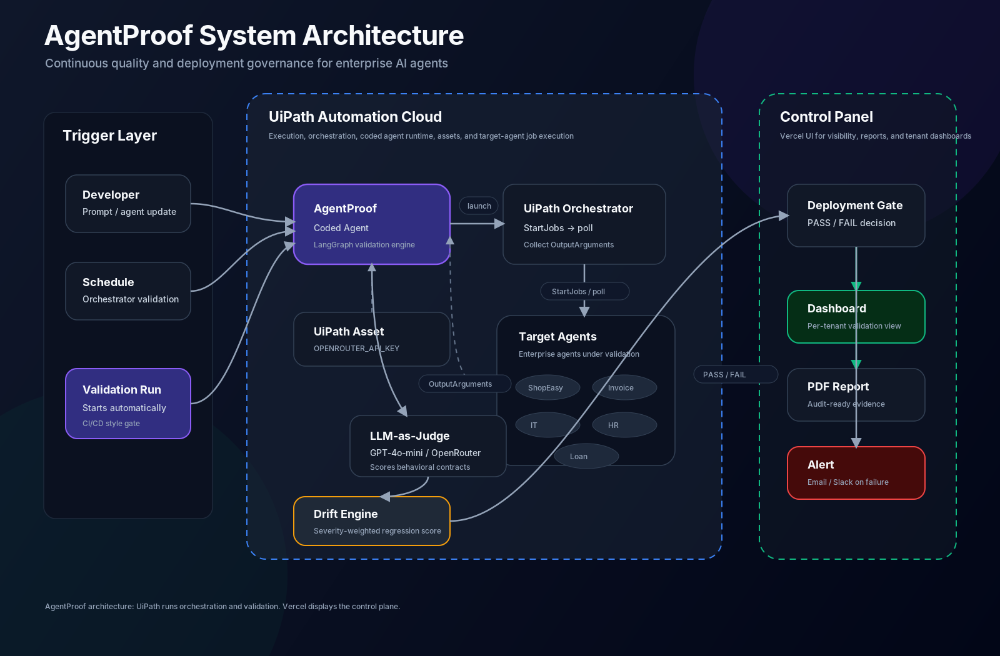
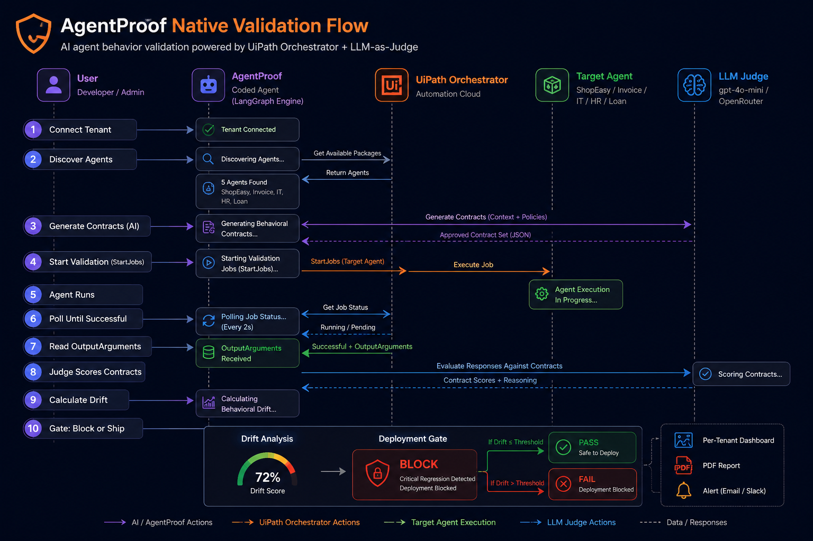
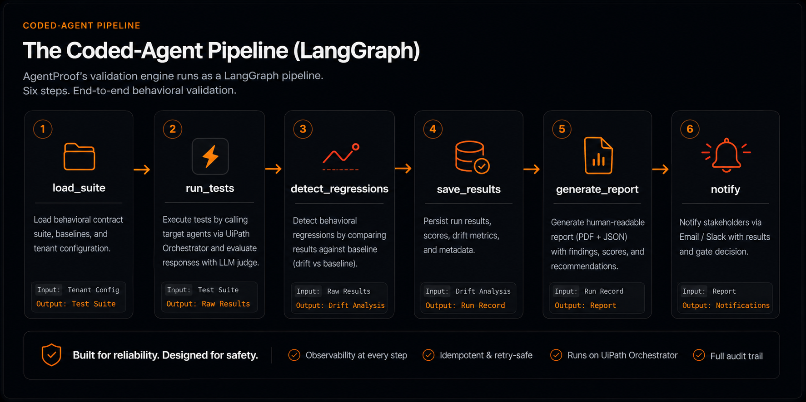

<div align="center">


# AgentProof

**The deployment gate for enterprise AI agents.**

Continuous behavioral validation and regression detection for AI agents — running natively on the UiPath Platform.

[](LICENSE)
[](https://uipath-agenthack.devpost.com/)
[](#)
[](#)
[](#built-with-uipath-for-coding-agents)

**[Live application](https://agentproof-opal.vercel.app)** · **[Demo video](#)** *(add link)* · **[Presentation](#)** *(add link)*

</div>

---

## Overview

AI agents change behavior silently. A prompt edit, a model upgrade, a tool or MCP change, or a knowledge-base refresh can alter how an agent responds while it continues to reply normally — so the regression reaches production unnoticed. Conventional tests assert on exact output and cannot validate probabilistic, language-based behavior.

AgentProof brings CI/CD discipline to AI agents. It expresses expected behavior as **behavioral contracts**, validates an agent against them on every change, compares the results to the last known-good baseline, and produces a deployment decision — gating releases before they reach users.

AgentProof is built and run **on the UiPath Platform**: the validation engine is a UiPath coded agent, and the agents it validates are executed as real UiPath Orchestrator jobs.



---

## How it works

| Step | Description |
|------|-------------|
| **1. Connect** | Authenticate with a UiPath tenant. AgentProof discovers the agents published in your Orchestrator. |
| **2. Define** | Describe expected behavior in plain language; an LLM generates the behavioral contracts. No manual test authoring. |
| **3. Validate** | Each scenario is run against the agent — natively, as a real UiPath Orchestrator job — and an LLM-as-judge scores every contract with a pass/fail, confidence, and reasoning. |
| **4. Detect drift** | Results are compared against the last passing baseline. A severity-weighted drift score yields a status of `PASSED`, `DEGRADED`, or `FAILED`. |
| **5. Gate** | On `FAILED`, the deployment is blocked. Regressions are listed with reasoning, an alert is raised, a PDF report is generated, and the run is recorded on a per-tenant dashboard. |

---

## Native execution on UiPath

Most agent-testing tools call an HTTP endpoint. AgentProof runs the agent on the platform: it starts a real Orchestrator job (`StartJobs`), polls the job to completion, reads the agent's output from `OutputArguments`, and validates that output against the contracts. UiPath Automation Cloud is the execution layer; the web application is the control panel.



> **Verified live.** The ShopEasy and IT Helpdesk agents were executed as Orchestrator jobs (state `Successful`) and judged on their actual output. Five demo agents are published to a real tenant and validate end to end.

---

## UiPath platform components

| Component | Usage |
|-----------|-------|
| **UiPath for Coding Agents (Claude Code)** | The entire solution — coded agent, engine, control panel, and tenant integration — was built using Claude Code. |
| **UiPath Coded Agents (Python SDK)** | The validation engine (`main.py`) is a coded agent implemented as a LangGraph pipeline, packaged with `uipath pack` and published to Orchestrator. |
| **UiPath Orchestrator** | Discovers published agents, starts them as jobs (`StartJobs`), polls execution, and retrieves results from `OutputArguments`. |
| **UiPath Assets** | Published agents read their runtime secret from an Orchestrator Asset, keeping credentials out of the package. |
| **UiPath Automation Cloud** | Agents execute on Automation Cloud; the tenant is the unit of identity and data isolation. |
| **External frameworks** | LangGraph for pipeline orchestration and OpenAI `gpt-4o-mini` (via OpenRouter) as the LLM judge. UiPath remains the orchestration and governance layer. |

---

## Architecture

A validation run proceeds from tenant connection through to the deployment gate:



The validation engine is a LangGraph coded agent composed of six nodes:



```
main.py                  Validation engine — LangGraph coded agent (UiPath entry point)
                         load_suite → run_tests → detect_regressions → save → report → notify
agentproof/
  contracts.py           Pydantic models (contracts, test cases, results)
  runner.py              Invokes the target agent
  validator.py           LLM-as-judge (gpt-4o-mini via OpenRouter)
  regression.py          Severity-weighted drift score and baseline comparison
  reporter.py            PDF report generation (Jinja2 + WeasyPrint)
  db.py                  PostgreSQL persistence (per-tenant)
server.py                Control panel: landing, live walkthrough, onboarding,
                         per-tenant dashboard, reports, UiPath discovery and job execution
shopease_support_agent/  Demo target agent (published UiPath coded agent)
target_agents/           Additional published agents (invoice, IT, HR, loan)
test_suites/             Behavioral test suites (JSON)
```

---

## Behavioral contracts

A behavioral contract is a typed rule the agent's response must satisfy. Because contracts are evaluated by an LLM judge, they validate probabilistic, language-based behavior that exact-match assertions cannot.

**Contract types:** `contains_intent` · `does_not_contain` · `sentiment` · `response_length` · `format_compliance` · `safety`

Each test case carries a severity that weights the drift score (`critical` ×3, `high` ×2, `medium` ×1, `low` ×0.5). Status thresholds: `PASSED` below 5%, `DEGRADED` 5–15%, `FAILED` above 15%.

---

## Getting started

**Prerequisites:** Python 3.12+, [`uv`](https://github.com/astral-sh/uv), an `OPENROUTER_API_KEY`, a PostgreSQL `DATABASE_URL`, and a UiPath Automation Cloud tenant.

```bash
# 1. Install
uv venv && source .venv/bin/activate && uv pip install -e .

# 2. Configure
cp .env.example .env        # set OPENROUTER_API_KEY and DATABASE_URL

# 3. Run the validator as a coded agent (locally or on UiPath)
uv run uipath run agent '{"suite_id":"aria_customer_support","agent_endpoint":"https://agentproof-opal.vercel.app/v1/chat"}'   # baseline → PASSED
uv run uipath run agent '{"suite_id":"aria_customer_support","agent_endpoint":"https://agentproof-opal.vercel.app/v2/chat"}'   # regressed → FAILED

# 4. Publish to UiPath Orchestrator
uipath auth && uipath pack && uipath publish --tenant
```

Alternatively, use the hosted application: open [agentproof-opal.vercel.app/test](https://agentproof-opal.vercel.app/test), connect your UiPath tenant, select a published agent, and run a validation.

<details>
<summary><strong>Database schema</strong></summary>

```sql
CREATE TABLE test_runs (
    id             TEXT PRIMARY KEY,
    suite_id       TEXT NOT NULL,
    timestamp      TIMESTAMPTZ NOT NULL DEFAULT NOW(),
    overall_status TEXT NOT NULL,
    drift_score    NUMERIC NOT NULL,
    regressions    JSONB,
    results        JSONB,
    agent_endpoint TEXT,
    tenant_id      TEXT
);
CREATE INDEX idx_test_runs_tenant ON test_runs (tenant_id, timestamp DESC);
```
</details>

---

## Built with UiPath for Coding Agents

Every layer of AgentProof — the LangGraph validation engine, the published coded agents, the Orchestrator REST integration, native job execution, per-tenant authentication, and the dashboard — was developed using **Claude Code via UiPath for Coding Agents**. The demo video includes the build process.

---

## License

Released under the [MIT License](LICENSE).

<div align="center">

*AgentProof — UiPath AgentHack 2026 · Track 3: UiPath Test Cloud*

</div>
